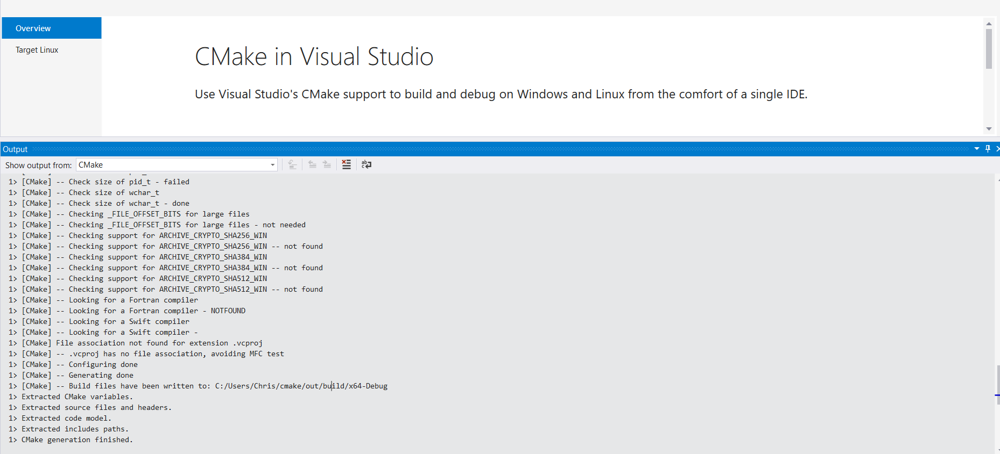
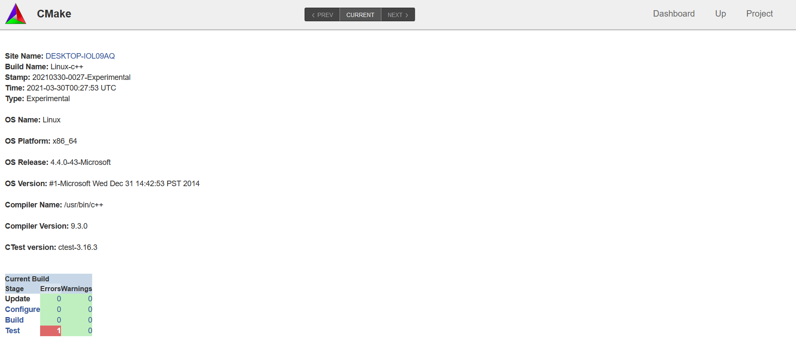
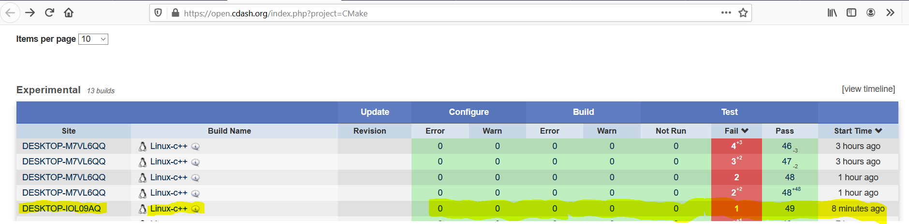
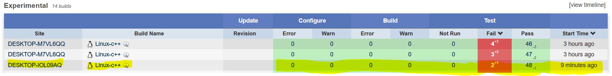
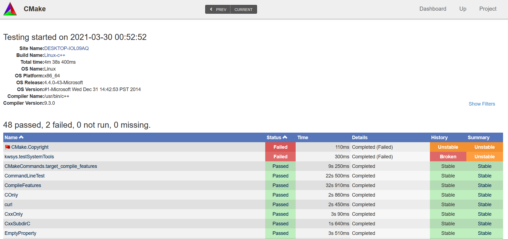
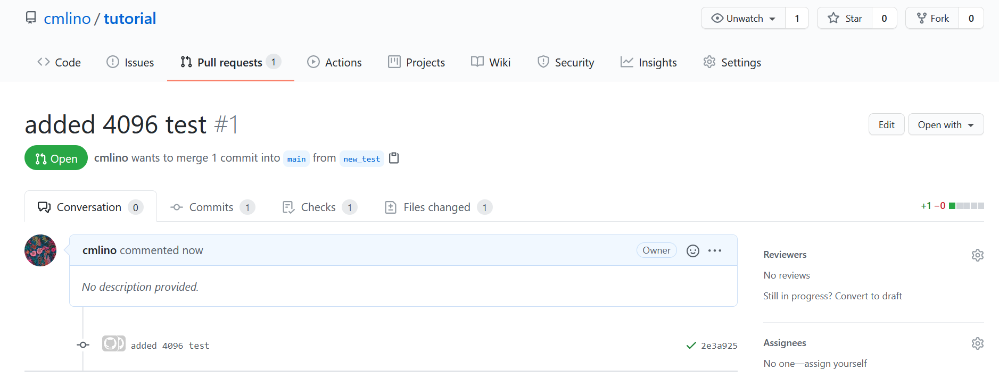
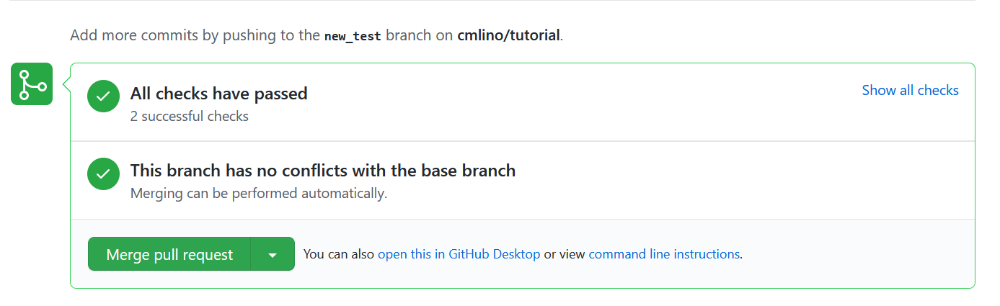

# Lab 8: Testing and Continuous Integration

## Checkpoint 1
Successful build:

## Checkpoint 2

## Checkpoint 3
3. Inspection shows that the failure comes from having changed the year from 2021 to 2020 in Copyright.txt.

4. Screenshot with copyright error:

5. Screeshot without copyright error:

## Checkpoint 4
Repository: https://github.com/cmlino/tutorial
Pull request:

Push:

## Checkpoint 5
My project does not have a Discord channel, so I included the information in this file:

Project Name: Buoy
Blog Link: https://rcos.io/projects/cmlino/buoy/blog
GitHub Link: https://github.com/cmlino/buoy
Collaborators: Christina Lino, Rylan O'Connell

