# Lab 8

## Example 0
Docker is running.
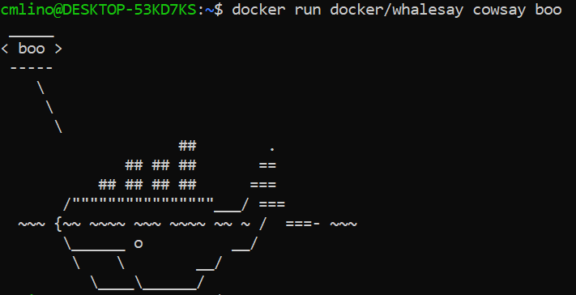

## Example 1
### Running the Ubuntu Container
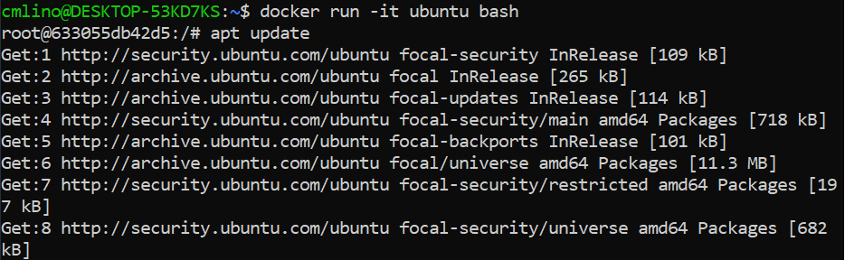

### Installing Vim
Vim was installed in the `/root` directory and was used to create `test.txt`.
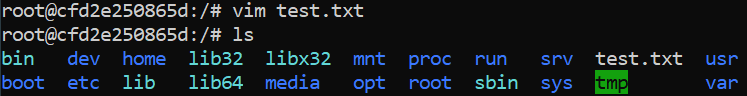

### Installing Cowsay
This is output when `cowsay "moo!" is run.
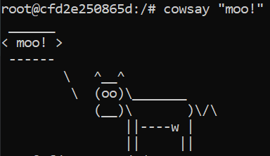

## Example 2
### Rocketchat
The following screenshot contains the set up of the RocketChat database as an instance of mongo, which is then linked to the mongo instance. The screenshot also shows a list of the running containers and examples of stopping and removing containers. The list of images is shown, and the image of ubuntu is also removed.
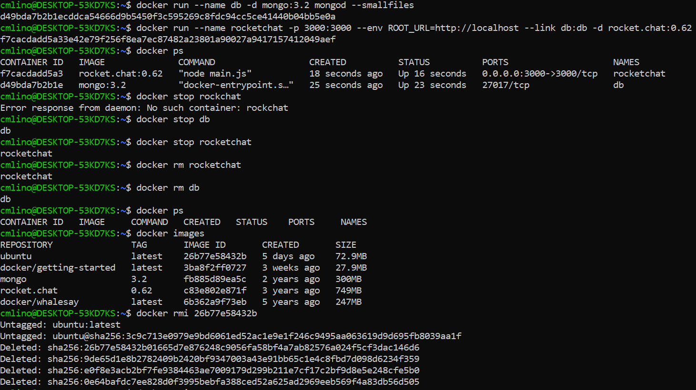

Here is an image of RocketChat in my local browser:
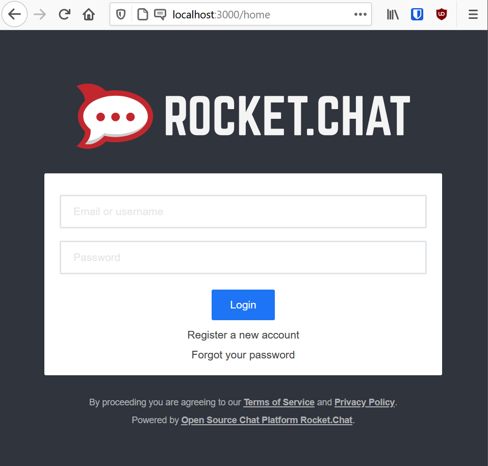

## Example 3
Here is the Dockerfile:
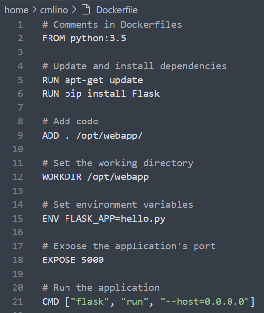

I built the Dockerfile, and ran the container and opened the port for the web server:
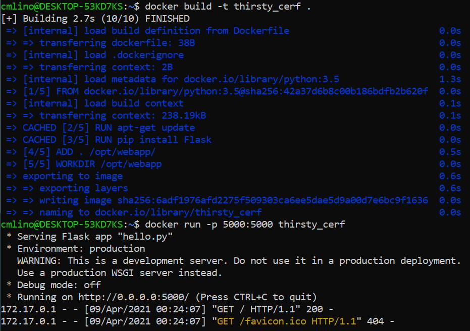

Here is the web server:
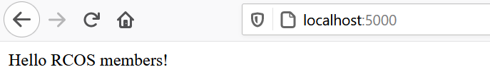

## Example 4
### Image creation
I created the Dockerfile:
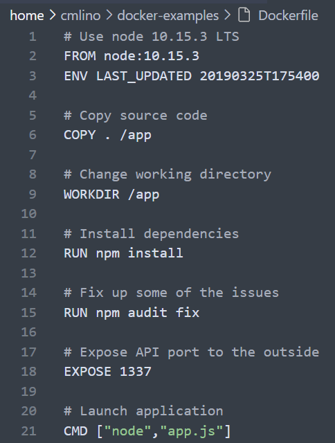

I created the docker image using the command `docker build -t message app .`:
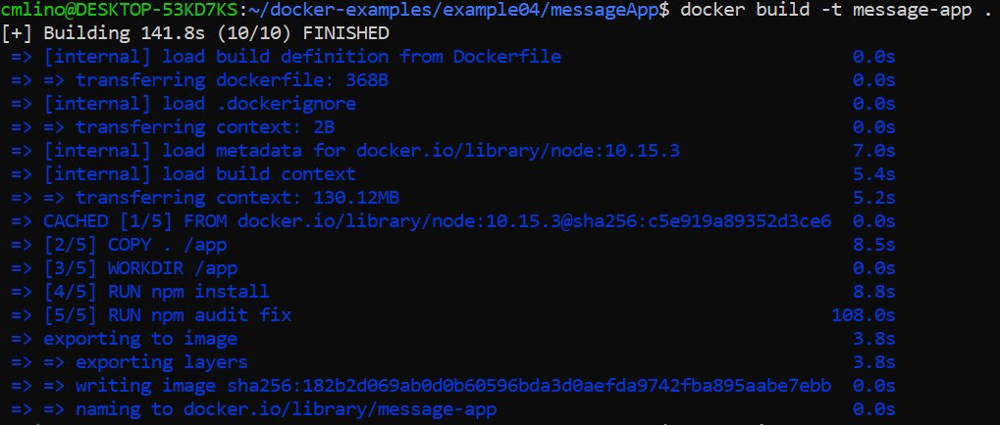

I list all images available on the Docker host:
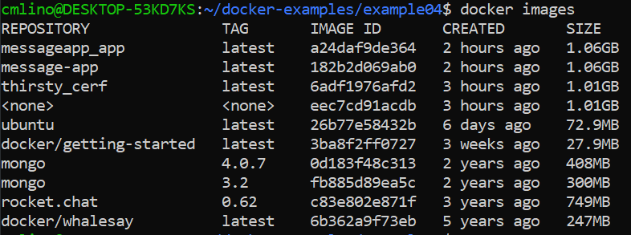

Docker-compose being built and run:
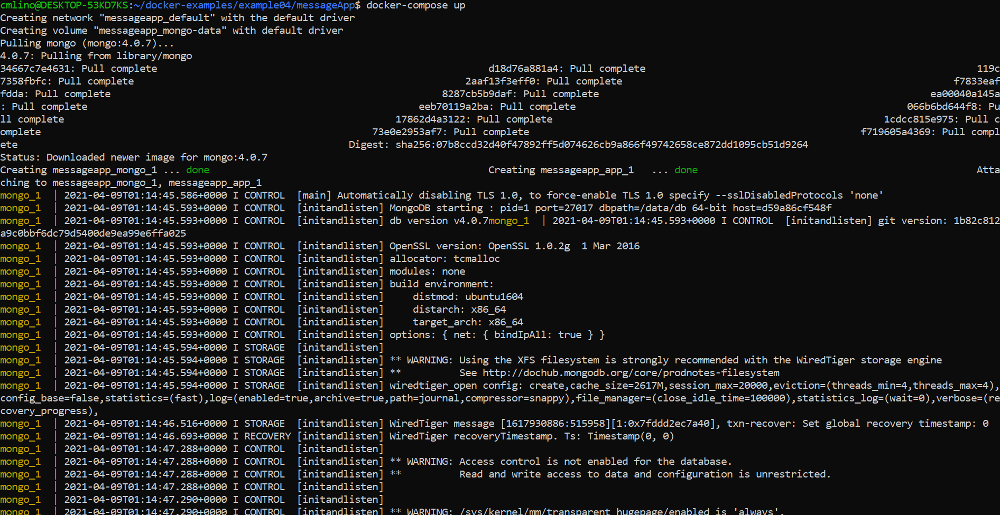
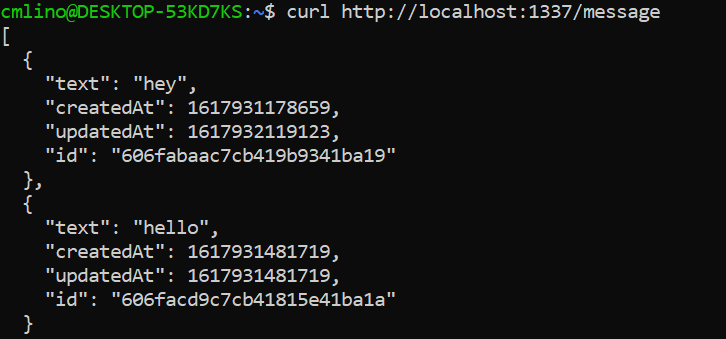

The build was successful. I added "hola" and "hello" to the list of messages. Here is a screenshot of the text `como_estas` being added to the list of messages and a list of all the messages that were added. 
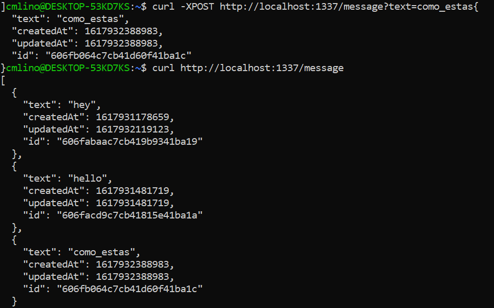

The following screenshot shows the `como_estas` message getting modified to be `estoy_bien`. The next commands delete `estoy_bien` from the list, and then show the list of remaining messages.
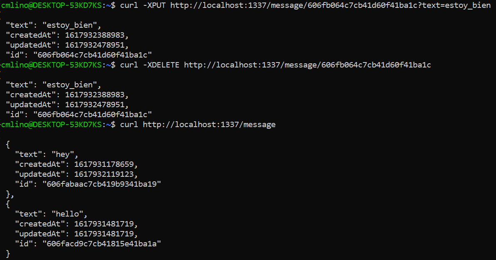