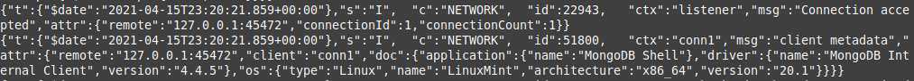
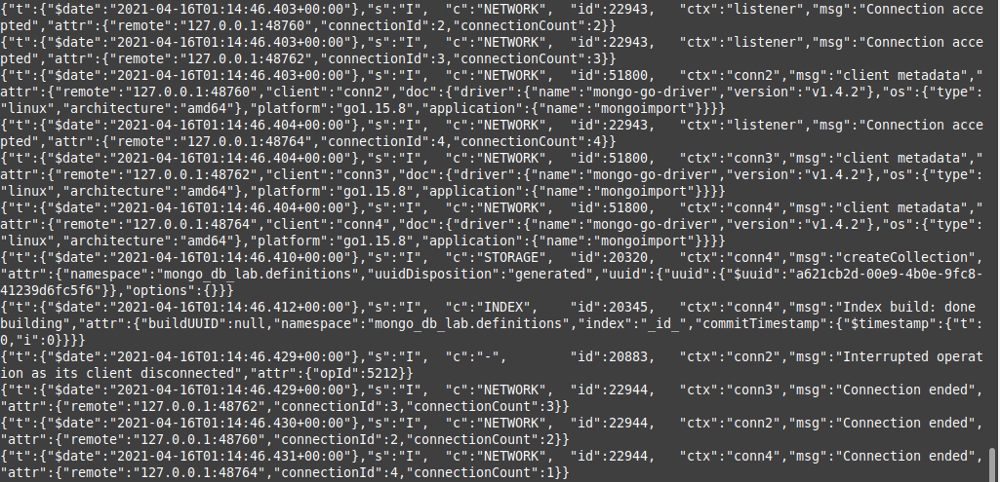
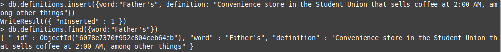
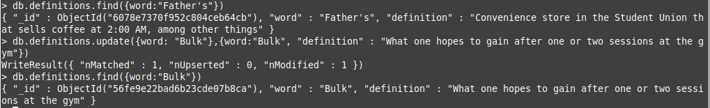
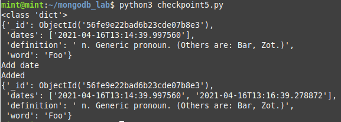

## Checkpoint 0: Project Updates
Link to project update

## Checkpoint 1: Install MongoDB
MongoDB has been properly installed. Here is a screenshot of the connection accepted message from the `mongod` window:


## Checkpoint 2: Load Some Data
This is a screenshot of the data being loaded into the database from the `mongod` window:


## Checkpoint 3: Basic Queries
I successfully added a definition of Father's to the dictionary:


I updated the definition of the word "bulk" in the dictionary:


This is the `git diff` of definitions.json:
```
@@ -17,7 +17,7 @@
{"_id":{"$oid":"56fe9e22bad6b23cde07b8c7"},"definition":" n. A very random and unpredictable sort of motion. Best typified by, say, a nice hot cup of tea. (Also see Halliday and Resnick.)","word":"Brownian Motion"}
{"_id":{"$oid":"56fe9e22bad6b23cde07b8c8"},"definition":" n. Your first degree, assuming you finish.","word":"B.S."}
{"_id":{"$oid":"56fe9e22bad6b23cde07b8c9"},"definition":" n. The Center for Industrial Innovation, or CII, as translated by lovers of Roman numerals.","word":"Building 102"}
{"_id":{"$oid":"56fe9e22bad6b23cde07b8ca"},"definition":" v. To erase, eradicate or otherwise remove from the face of the Earth.","word":"Bulk"}
{"_id":{"$oid":"56fe9e22bad6b23cde07b8ca"},"word":"Bulk","definition":"What one hopes to gain after one or two sessions at the gym"}
{"_id":{"$oid":"56fe9e22bad6b23cde07b8cb"},"definition":" n. (RPI) For those who don't listen to WPYX, and still don't know this term, it means Albany and Rensselaer Counties and the general surrounding area.","word":"Capitaland"}
{"_id":{"$oid":"56fe9e22bad6b23cde07b8cc"},"definition":" n.  A package containing munchies, junk food and probably a stuffed animal, intended to ease homesickness.","word":"Care Package"}
{"_id":{"$oid":"56fe9e22bad6b23cde07b8cd"},"definition":" n. The nerd-food restaurant in the Folsom Library.","word":"Chez Stavo"}
@@ -86,7 +86,7 @@
{"_id":{"$oid":"56fe9e22bad6b23cde07b90c"},"definition":" n. The device resembling a terminal in any RPI-provided kit-chen, it is used to heat food and eradicate numerous forms of matter in general.","word":"Nukerowave"}
{"_id":{"$oid":"56fe9e22bad6b23cde07b90d"},"definition":" n. The existential penguin in ``Bloom County,'' a comic strip that can only be found in The Boston Globe, and occasionally in The Poly.","word":"Opus"}
{"_id":{"$oid":"56fe9e22bad6b23cde07b90e"},"definition":" n. The Hudson River, DAKA food, chem labs.","word":"Organic Waste Products"}
{"_id":{"$oid":"56fe9e22bad6b23cde07b90f"},"definition":" n. Parental units, Pa and Ma.","word":"P \u0026 M"}
{"_id":{"$oid":"56fe9e22bad6b23cde07b90f"},"definition":" n. Parental units, Pa and Ma.","word":"P & M"}
{"_id":{"$oid":"56fe9e22bad6b23cde07b910"},"definition":" v.  The act of convincing your parents that the $15K a year spent on your lifesupport at RPI is worth the expense, despite your grades.","word":"Parental Maintenance"}
{"_id":{"$oid":"56fe9e22bad6b23cde07b911"},"definition":" n. A social gathering with a goal of mixed group interrelating, drinking, etc. --- v. To enjoy the company of others and not be involved in studying. --- adj. To be desirable to have at a party (e.g. ``He's quite a party guy'').","word":"Party"}
{"_id":{"$oid":"56fe9e22bad6b23cde07b912"},"definition":" n.  One of the options available to a Tute student. A class on Pass-Punt does not count against you if you fail or do poorly; it also does not help your GPA even if you do incredibly well. Officially called ``Pass-No Credit.''","word":"Pass-Punt"}
@@ -145,3 +145,4 @@
{"_id":{"$oid":"56fe9e22bad6b23cde07b947"},"definition":" n. Calzone, a folded-over za.","word":"Zone"}
{"_id":{"$oid":"56fe9e22bad6b23cde07b948"},"definition":" n. Air Force ROTC type.","word":"Zoomie"}
{"_id":{"$oid":"56fe9e22bad6b23cde07b949"},"definition":" v.  To copy onto a reused piece of magnetic tape, e.g., cassette or video tape.","word":"Zurn"}
{"_id":{"$oid":"6078e7370f952c804ceb64cb"},"word":"Father's","definition":"Convenience store in the Student Union that sells coffee at 2:00 AM, among other things"}
```


This is a link to my pr: https://github.com/rcos/mongodb_lab/pull/9/files

## Checkpoint 4: Driving Queries
This is a link to checkpoint4.py:
This is a link to the output for that file:

## Checkpoint 5: Random Word Requester
This is a link to my checkpoint5.py:
This is a screenshot to the output for a word that was visited twice:

