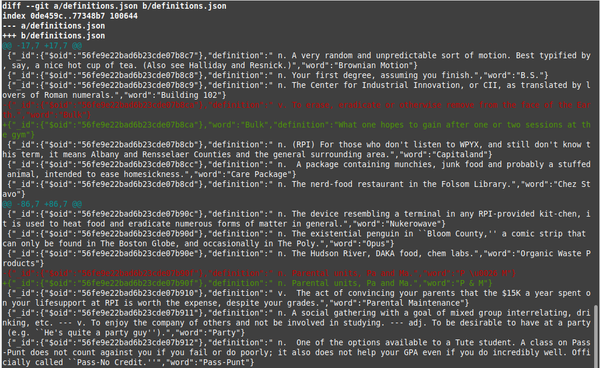
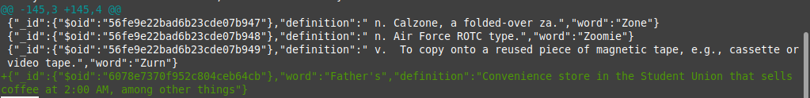

## Checkpoint 0: Project Updates
Project update: https://github.com/cmlino/buoy/discussions/7

## Checkpoint 1: Install MongoDB
MongoDB has been properly installed. Here is a screenshot of the connection accepted message from the `mongod` window:


## Checkpoint 2: Load Some Data
This is a screenshot of the data being loaded into the database from the `mongod` window:


## Checkpoint 3: Basic Queries
I successfully added a definition of Father's to the dictionary:


I updated the definition of the word "bulk" in the dictionary:


This is the `git diff` of definitions.json:




This is a link to my pr: https://github.com/rcos/mongodb_lab/pull/9/files

## Checkpoint 4: Driving Queries
checkpoint4.py:
```
from bson.objectid import ObjectId
from pymongo import MongoClient
import pprint
client = MongoClient('localhost', 27017)
db = client.mongo_db_lab
collection = db.definitions

if __name__ == '__main__':
    

    # Fetch all records
    print("Fetch all records")
    for definition in collection.find():
        pprint.pprint(definition)
    
    print("\n\n")

    # Fetch one record
    print("Fetch one record (random)")
    pprint.pprint(collection.find_one())

    print("\n\n")
    print("Fetch a specifc record (word: bulk)")
    pprint.pprint(collection.find_one({"word": "Bulk"}))

    print("\n\n")

    print("Fetch a record by oject id")
    pprint.pprint(collection.find_one({"_id": ObjectId("56fe9e22bad6b23cde07b8ce")}))

    print("\n\n")

    # Insert a new record
    collection.insert_one({"word": "Orange", "definition": "Color of a nice sunset"})
    pprint.pprint(collection.find_one({"word": "Orange"}))
```

Output for checkpoint4.py:
https://github.com/cmlino/oss-repo/blob/master/labs/lab-10/output.txt

## Checkpoint 5: Random Word Requester
checkpoint5.py:
```
from bson.objectid import ObjectId
from pymongo import MongoClient
from random import choice
import datetime
import pprint

client = MongoClient('localhost', 27017)
db = client.mongo_db_lab
collection = db["definitions"]

def random_word_requester():
    records_list = []

    for r in collection.find():
        records_list.append(r)

    selected = choice(records_list)

    pprint.pprint(selected)

    current_time = datetime.datetime.utcnow().isoformat()
    current_dates = []
    if 'dates' in selected.keys(): 
        current_dates = selected['dates']
    current_dates.append(current_time)
    id = ObjectId(selected['_id'])
    word = selected['word'] 

    print("Add date")
    collection.update_one({"word": word}, {"$set":{"dates": current_dates}})

    print("Added")
    pprint.pprint((collection.find_one({"word": word })))
    
if __name__ == "__main__":
    random_word_requester()
```
This is a screenshot to the output for a word that was visited twice:
