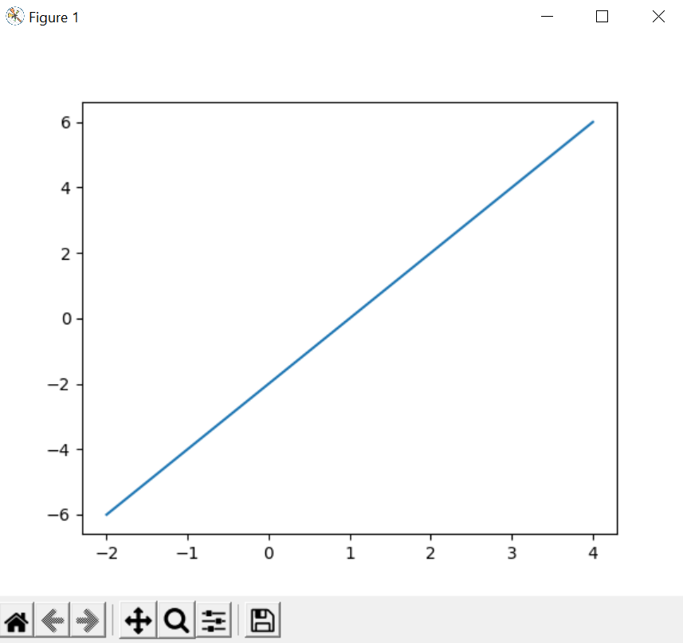
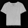

## Checkpoint 1: Verify Your TensorFlow

This is a screenshot of the pop-up:



## Checkpoint 2: Run a TensorFlow classification


## Checkpoint 3: 
I included the original images and their edited versions (converted to greyscale, 28x28 pixels, and inverted). The images were scaled within the Tensorflow program.


```
[[7.2219664e-01 1.9135081e-05 3.8549288e-03 2.0490482e-04 5.8773046e-05
  1.6836414e-07 2.7363554e-01 5.2229488e-14 2.9891353e-05 2.2641233e-10]]
```
The image was predicted to be of a t-shirt or a top. It's a t-shirt, so this prediction was pretty accurate.



```
[[2.0479086e-01 1.0786996e-06 1.3100503e-04 1.4576639e-04 5.5848345e-06
  3.2908595e-08 7.9492527e-01 6.0002177e-12 3.6161140e-07 9.4586046e-09]]```
```
This image was precicted to be of a shirt or a t-shirt. It's more of a shirt than a t-shirt, so this prediction was accurate. 


```
[[1.0545028e-01 3.0313795e-05 1.2807885e-01 2.0445989e-02 8.0884203e-02
  1.4935188e-05 6.0774606e-01 3.2681544e-09 5.7344832e-02 4.5612123e-06]]
```
This image was most likely harder to classify becuase it's patterned. The image features shorts, but the model predicted the item to be a shirt. 
